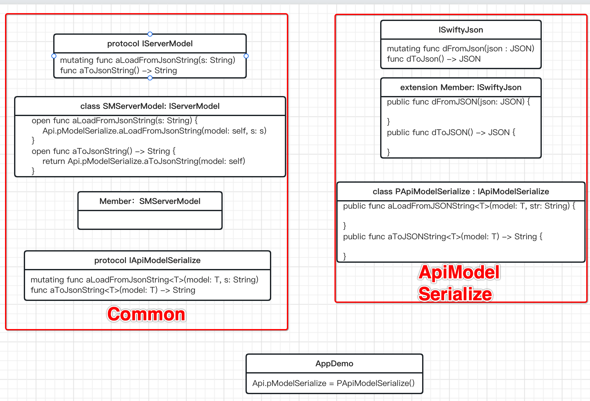
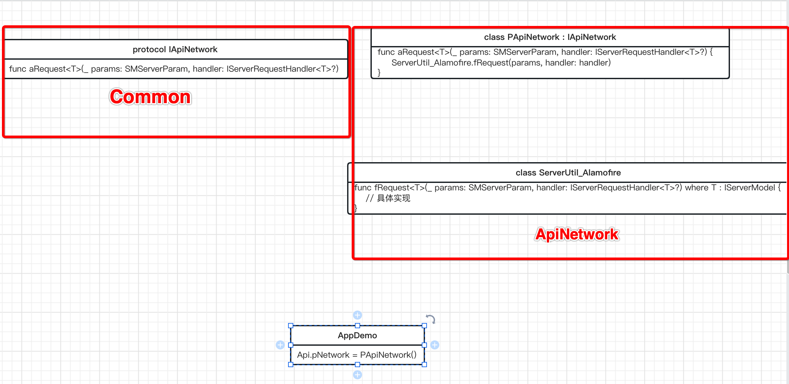

### AppDemo
*目标是将序列化和网络请求做成可替换的模块.*

```swift
workspace 'AppDemo.xcworkspace'
platform :ios, '13.0'

use_frameworks!
load './Api/api_v1.rb'

target :Common do
  project 'Common/Common.xcodeproj'
  pod 'Alamofire'
 end

target :AppDemo do
	project 'App/AppDemo/AppDemo.xcodeproj'
	pod 'Common', :path => './Common/'
	
	load_api_pods
end

target :ApiModelSerialize do
  	project 'Api/ApiModelSerialize/ApiModelSerialize.xcodeproj'

  	pod 'Common', :path => './Common/'
  	pod 'SwiftyJSON'
end

target :ApiNetwork do
	project 'Api/ApiNetwork/ApiNetwork.xcodeproj'

	pod 'Common', :path => './Common/'
  pod 'Alamofire'
end
```
load_api_pods是一个单独.rb文件, 想替换模块的话就修改这个文件.
```ruby
def load_api_pods
	pod 'ApiModelSerialize', :path => './Api/ApiModelSerialize/'
	pod 'ApiNetwork', :path => './Api/ApiNetwork/'
end
```
### 序列化(ApiModelSerialize)
在ApiModelSerialize这个framework中声明一个protocol
```
protocol ISwiftyJson {
    init()
    
    mutating func dFromJSON(json: JSON)
    func dToJSON() -> JSON
}
```
再为一些基本类型扩展遵循一下这个protocol
```
extension Int: ISwiftyJson {
    mutating func dFromJSON(json: JSON) {
        self = json.intValue
    }
    
    func dToJSON() -> JSON {
        var json = JSON()
        json.intValue = self
        return json
    }
}
```
需要序列化的Model也需要扩展遵循一下这个protocol
```
extension Member: ISwiftyJson {
    
    public func dFromJSON(json: JSON) {
        Id = json["Id"].intValue
    }

    public func dToJSON() -> JSON {
        var json = JSON()
        json["Id"].intValue = Id
        return json;
    }
}
```
现在序列化是基本上算是实现了, 但是还需要封装一下.
Common中声明一个protocol

```
public protocol IApiModelSerialize {
    mutating func aLoadFromJSONString<T>(model: T, str: String)
    func aToJSONString<T>(model: T) -> String
    func aConvertJSONStringToArray<T>(type: T.Type, str: String) -> [T] where T: ServerModel
}
```
ApiModelSerialize中遵循一下这个protocol
```
public class PApiModelSerialize: IApiModelSerialize {

    public init() {
        
    }
    
    public func aLoadFromJSONString<T>(model: T, str: String) {
        if var m = model as? ISwiftyJson {
            m.dFromJSON(json: JSON(parseJSON: str))
        }
    }
    
    public func aToJSONString<T>(model: T) -> String {
        if let m = model as? ISwiftyJson {
            return m.dToJSON().rawString()!
        }
        fatalError("Can't deSerialize")
    }
    
    public func aConvertJSONStringToArray<T>(type: T.Type, str: String) -> [T] where T : IServerModel {
        let arrayValue = JSON(parseJSON: str)
        var array = [T]()
        for j in arrayValue {
            if let jsonString = j.1.rawString() {
                var t = T()
                t.aLoadFromJSONString(str: jsonString)
                array.append(t)
            }
        }
        return array
    }

}
```
Common中声明一个protocol
```
public protocol IServerModel {
    init()
    
    mutating func aLoadFromJSONString(str: String)
    func aToJSONString() -> String
}
```
ServerModel作为所有Model的父类遵循这个protocol
```
open class ServerModel: IServerModel {
    public required init() {
        
    }
    
    open func aLoadFromJSONString(str: String) {
        Api.pModelSerialize.aLoadFromJSONString(model: self, str: str)
    }
    
    open func aToJSONString() -> String {
        return Api.pModelSerialize.aToJSONString(model: self)
    }
}
```
现在Model就可以实现与JSON或JSON字符串互转。

#### 结构如下图所示



### 网络请求(ApiNetwork)
Common中声明一个protocol
```
public protocol IApiNetwork {
    func aRequest<T>(_ params: ServerParam, handler: IServerRequestHandler<T>?) where T: IServerModel
}
```
ApiNetwork中遵循一下这个protocol
```
public class PApiNetwork: IApiNetwork {

    public init() {
        
    }
    
    public func aRequest<T>(_ params: ServerParam, handler: IServerRequestHandler<T>?) where T : IServerModel {
        ServerUtil_Alamofire.fRequest(params, handler: handler)
    }

}
```
### 结构如下图所示



实际使用中调用一下就可以了

```
open class ServerUtil_Account {

    private static let c_Controller = "Account"
    
    public static func Login(loginParam: LoginParam, handler: IServerRequestHandler<MyProfile>?) {
        let param = ServerParam(post: true)
            .controller(c_Controller)
            .action("Login")
            .add(value: loginParam)
        Api.pNetwork.aRequest(param, handler: handler)
    }

}
```
### 关联声明与实现
ApiModelSerialize和ApiNetwork声明在Common中, 实现在具体framework中, 在App中需要将他们关联起来.
```
class AppConfigImpl {

    init() {

    }
    
    func connect() {
        Api.pModelSerialize = PApiModelSerialize()
        Api.pNetwork = PApiNetwork()
    }

}
```
```
class AppDelegate: UIResponder, UIApplicationDelegate {
    
    var window: UIWindow?
    
    func application(_ application: UIApplication, didFinishLaunchingWithOptions launchOptions: [UIApplication.LaunchOptionsKey : Any]? = nil) -> Bool {
        AppConfigImpl().connect()
        return true
    }

}

```
最后用登录功能做一下验证
```
        ServerUtil_Account.Login(loginParam: loginParam, handler: IServerRequestHandler<MyProfile>({data in
            print(data.Member?.NickName)
        }, fail: { (failInfo) in
            
        }))
```
### 代码
https://github.com/drenhart/AppDemo.git